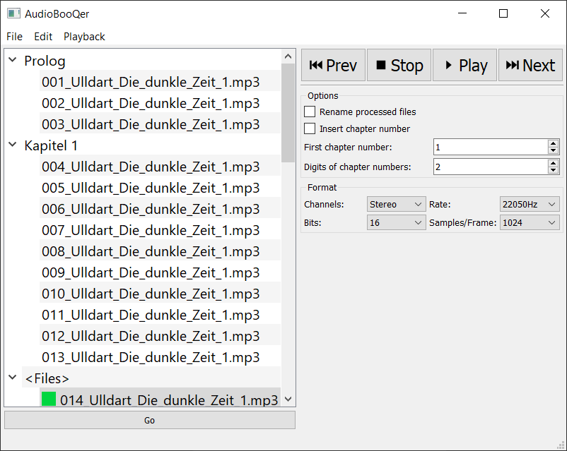
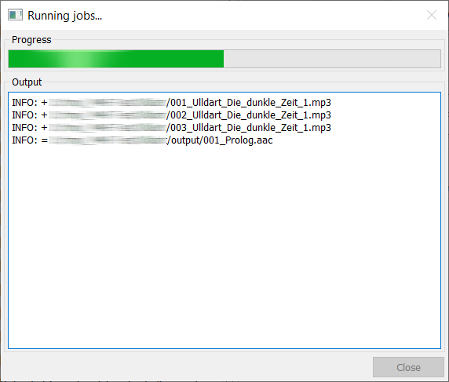
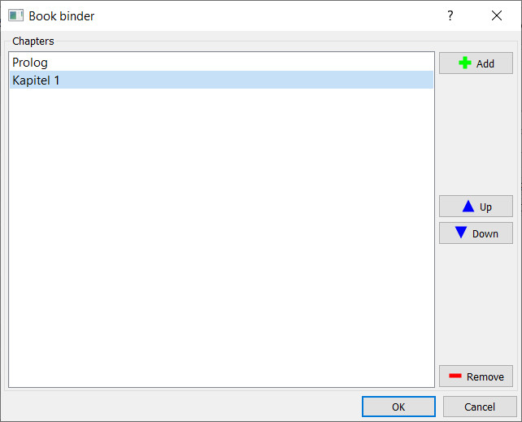
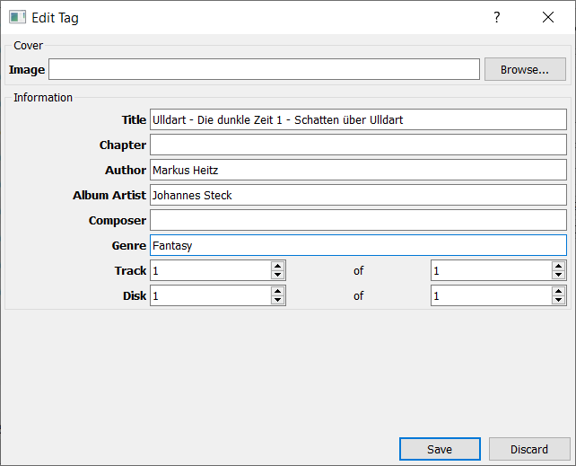

# AudioBooQer

## Introduction

**AudioBooQer** is an application that lets you create audiobooks from audio files.

The resulting audiobook will be an `AAC` encoded, **iTunes** compatible `M4B` (`MP4`) file.

## Quick Start

### Step 1: Create chapters

Open a directory (`Ctrl+O`) with the tracks of your audiobook and group them into chapters.

While encoding the chapters to `AAC`, **AudioBooQer** uses all available cores!

### Step 2: Bind an audiobook

Bind the encoded chapters (`Ctrl+B`) to a single audiobook in `M4B` format.

### Step 3: Tag the audiobook

Tag the audiobook (`Ctrl+T`) to supply meta information.

